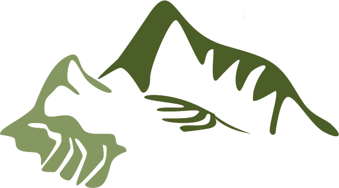

# Tikraq
<p style="text-align: center;">
    
</p>

# Integrantes

- Salazar Alva, Rodrigo
- Morales Panitz, Alexander
- Ugarte Quispe, Grover
- Magot, Francisco
- Dominguez, Pedro

## Resumen
La inclusión en el mundo de la computación a lo largo de la historia ha tomado un rol importante para
la sociedad. Si bien, la mayoría de lenguajes de programación están enfocados para un público que
maneje de manera básica términos en inglés (siendo éste el estándar base para cualquier propuesta),
la idea principal de la propuesta es cubrir ese vacío adaptando la sintaxis al Quechua, siendo esta una
manera más accesible para el sector quechuahablante.

```
compiladores@linux$ ./lexpar < test.tik
```
